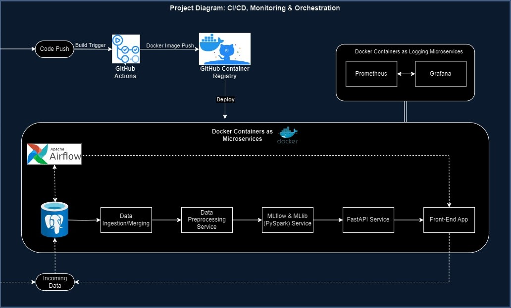

# ML-Pipeline-Co2
## End-to-End Machine Learning Pipeline for Predicting CO2 Emissions in Construction Logistics

This project develops an end-to-end machine learning pipeline to predict CO2 emissions in construction logistics. It leverages PySpark, Apache Airflow, Docker, PostgreSQL and Github Actions to simulate a big data environment and production at scale. 

The project is in development. Once V1 is deployed, the upgrades to followe are:
- Implement a chatbot - will use LLM and fine-tune it on the Logistics Data so that users can ask questions about it and receive answers
- Include Apache Beam in the tech-stack to unify all data processing jobs (which are currently performed in scripts and managed by Apache Airflow)
- more to follow ..

### Objective
The aim is to create a robust pipeline capable of handling large-scale data, simulating real-world scenarios in construction logistics, and providing accurate predictions of CO2 emissions. The emphasis of the Project is on the ML-Ops side. The Project is aimed at having a sophisticated, production-ready solution that adheres to high standards of modern software engineering and data management practices. It is designed to be both resilient and adaptable, which are necessary qualities for handling the complexities and dynamics of real-world, large-scale data applications.

### Architecture Diagram


#### Architecture Overview:
This architecture is designed to be scalable and handle large-scale data pre-processing:

- **Code Push & Build Trigger**:
  - Initiates the CI/CD process, automating the testing, building, and deployment of the microservices.
  - *GitHub Actions* as it's easy to integrate with GitHub repositories and automating workflows.

- **Docker Image Push & GitHub Container Registry**:
  - Docker images are built for each service --> ensures consistency and isolation of environments.
  - The *GitHub Container Registry* stores the Docker images and provides easy access for deployment.

- **Docker Containers as Microservices**:
  - Each service in the pipeline is containerized, allowing for independent scaling and deployment, which increases the overall system's resilience and flexibility.
  - *Docker* is chosen becasue it is easy of integrate with CI/CD tools and is widely adopted in the industry.

- **Apache Airflow**:
  - Orchestrates the workflow, managing data ingestion, processing, and scheduling of tasks.
  - Note: Airflow is not an event-driven system so it doesn't automatically detect changes like new data added to the PostgreSQL DB. However, periodic checks are scheduled and triggers are set to initiate the workflow.

- **Data Ingestion/Merging**:
  - Responsible for the collection and merging of data from PostgreSQL.
  - This step ensures that the data is in a consistent state for further processing.

- **Data Preprocessing Service**:
  - Processes raw data to prepare it for machine learning, including tasks like cleaning, transformation, and feature engineering.

- **MLflow & MLlib (PySpark) Service**:
  - *MLflow* manages the machine learning lifecycle, including experimentation, reproducibility, and deployment.
  - *MLlib* is Spark's machine learning library. It's scalabile and can process large datasets with distributed computing.

- **FastAPI Service**:
  - Exposes the machine learning models as a RESTful API
  - *FastAPI* is easy to use and has automatic generation of OpenAPI documentation which saves time

- **Front-End App**:
  - A user interface that interacts with the FastAPI service to display the results from the machine learning models to end-users.

- **Monitoring with Prometheus & Grafana**:
  - *Prometheus* is used for tracking the performance of microservices over time and log various metrics.
  - *Grafana* is used in conjunction as it offers visualisation capabilities that will simplify the understanding of the logs and metrics   provided by Prometheus

### LLM implementation - Architecture Diagram (3 potential options)


### LLM Architecture Overview:

#### Option 1
- **Pros**: 
  - High accuracy for data-specific queries. Text to SQL (NL2SQL) return exact information from DB
  - Precise: for a question like "What is the total CO2 emission for truck transport in 2020?", the system can execute an exact SQL query to calculate this sum from your logistics data
  - Faster: direct query to DB and fast response
- **Cons**: 
  - Limited to just queries: for instance, if a user asks, "Which transportation method is least harmful to the environment?" the system will struggle as it requires interpretive analysis and not just data retrieval

#### Option 2
- **Pros**:
  - NLP: can understand and respond to a wider range of queries. For example "Tell me about the major suppliers in 2020 and their ratings" would be interpreted correctly
  - More Complex Queries: for example look at trends like "What trends have we seen in material costs over the last five years?"
- **Cons**:
  - Limited to Training Data: For example if the model wasn’t trained with data from 2017, it can’t accurately answer "What was the average project budget in 2017?".
  - Approximations instead of Precision: For a specific query like "How much material was transported by rail in Q3 of 2019?", the model will provide an estimated answer rather than an precise one because it doesn't directly query the database
  
  - Generating Training Data is a lenghty process:
    - 1: Data Aggregation and Analysis: statistics about the data
    - 2: Text Descriptions and Narrative: Create descriptions about the statistics from the data. For example "Projects using Rail transport tend to have a lower average transportation cost compared to Truck transport. In 2020, projects using Rail had an average transportation cost of X whereas Air transport averaged Y."
    - 3: Question & Answer Pairs: Formulate questions based on the narrativesves created
    - 4: Add Context and Comparisons
    - 5: Include cases for outliers: for example what if some urgent shipment is needed?
    - 6: Create Vector Embeddings that an LLM can understand

#### Option 3
In a hybrid system, use an LLM to understand the question's intent and then decide whether to:
  - Execute an SQL query for precise data retrieval
  - Use the LLM's trained knowledge to answer more complex queries

- **Pros**:
  - best of both worlds
- **Cons**:
  - more difficult to implement and requires efficient decision-making in the intent detection and data processing layer
- **Flow Example 1**:
  - *User Query*: "What was the most used material in projects during 2020?"
  - *Chatbot Interface*: Receives the query and passes it to the LLM
  - *LLM for Intent Recognition*: The LLM interprets the query as needing a statistical analysis 
  - *Data Processing Layer*: Decides that this query requires precise data retrieval
  - *Query Processor and Database*:
    -   Translates the LLM’s interpretation into a SQL query: "SELECT material_id, COUNT() FROM logistics_data WHERE YEAR(transaction_date) = 2020 GROUP BY material_id ORDER BY COUNT() DESC LIMIT 1"
    - Executes the query and retrieves the specific answer
  - *Response to User*: Provides the exact material ID or name that was most used in 2020

- **Flow Example 2**:
  - *User Query*: "Does rail transport typically results in lower transportation costs than truck transport? In 2020, what was the average cost difference?"
  - *Chatbot Interface*: Receives the query and passes it to the LLM
  - *LLM for Intent Recognition*: Analyzes the query and identifies two distinct parts:
    - A general trend analysis ("Does rail transport typically results in lower transportation costs than Truck transport?")
    - A specific data request ("In 2020, what was the average cost difference")
  - *Data Processing Layer*: 
    - Determines that the first part of the query can be answered based on the patterns and trends the LLM learned during training
    - Determines that the second part requires a specific data query to fetch the exact number from the database
  - *Hybrid Approach kicks in*:
    - LLM Response for first part
    - Query Generated for second part and retireve data from DB
  - *Response to User*: Combine the response from both the LLM and the DB Query
    - Example response: ""Rail transport typically results in lower transportation costs than Truck transport. In 2020, the average cost difference was £5 Mil"
  - *Human Loop*: system could ask for feedback on response and based on human response in can log the info for future improvements
  
---

## Data Ingestion and Storage

### Data Source Simulation
- **Script-Generated Data**: Simulate real-time data streams.
- **Periodic Data Generation**: Push data into the pipeline at regular intervals to mimic real-world data flow.
- **Local PostgreSQL Database**: Manually populated with initial data sets. Future updates will introduce more data to simulate evolving datasets.

### Local Storage Solution
- **Filesystem-Based Approach**: Emulate a data lake structure for scalability.
- **Local PostgreSQL Database**: Implemented for structured data management.

### Scripts to Process Data
- **Data Ingestion Script**: `data_ingestion.py` for efficient data extraction and preparation.
- **Data Merging Script**: `data_merging.py` to merge the 4 datasets ingested from data_ingestion.py - this produces a unique joined dataset for preprocessing and modelling.

### Utility Script
- `script_utils.py` to manage environamental variables and loggin setup
---

## PostgreSQL Database Configuration and Data Import

### Setting up PostgreSQL
- **Installation**: Install PostgreSQL in the environment.
- **Database and User Creation**: Specific to the project.

### Configuring PostgreSQL Authentication
- **Authentication Method**: Utilize `scram-sha-256` for security.
- **Configuration File Location**: `/etc/postgresql/<version>/main/pg_hba.conf`.
- **Service Restart**: Execute `sudo service postgresql restart` after modifications.

### Configure Postgres Drivers
- **Create a drivers folder in the root directory**: place the postgresql driver pgJDBC in the root dir. Download it from the website (https://jdbc.postgresql.org/download/). You will need this driver to post data to your local db. It is used in `data_merging.py`

### Data Import Script
- **Shell Script**: `run_sql.sh` for importing CSV data.
- **Usage**: Replace paths in the script with actual data and SQL file locations.
- **Execution**:
   ```bash
   #!/bin/bash
   CSV_PATH="/your/path/to/logistics_data.csv" # Replace with your path
   SQL_FILE="/your/path/to/sql/import_script.sql" # Replace with your path

   # Replace placeholder in SQL file and execute
   sed "s|<PATH_TO_CSV>|${CSV_PATH}|g" $SQL_FILE | psql -U your_username -d your_database
- **Script Permission**: Make executable with chmod +x run_sql.sh.
- **Run**: Execute with ./run_sql.sh.

### Environment and Security
- **.env File**: For secure database credential managemen and for variables used in the project
- **Security Note**: Exclude .env from version control for privacy.## Apache Airflow Integration


## Airflow Set-up
Integration of Apache Airflow to enhance the automation, scheduling, and monitoring of pipeline workflows.

### 1. Installation
- Installed Apache Airflow within the project's virtual environment to maintain an isolated setup.
- Used the command `pip install apache-airflow` for installation.

### 2. Initializing Airflow
- Ran `airflow db init` to initialize Airflow's metadata database.
- This command created the default `~/airflow` directory, housing the configuration and DAG files.

### 3. PostgreSQL Configuration
- Configured Airflow to use PostgreSQL instead of the default SQLite for improved performance, concurrency handling, and scalability in production environments.
- Created a dedicated PostgreSQL database and user (airflow_db and airflow_user) for Airflow.
- Modified the `sql_alchemy_conn` line in `airflow.cfg` within the project's `airflow` directory to connect to the PostgreSQL database.
- Set `AIRFLOW_HOME` to the project's `airflow` directory and re-initialized Airflow with `airflow db init` for a project-centric approach, enhancing manageability and collaboration.
  
### Set-up contd...  
- Set-up Airflow authentication by running this code in the environemnt where Airflow is installed:
    ```bash
    airflow users create \
    --username [your_username] \
    --firstname [Your First Name] \
    --lastname [Your Last Name] \
    --role Admin \
    --email [your_email@example.com] \
    --password [your_password]
- Start Airflow webserver with `airflow webserver -p 8080` and access airflow UI from browser on `http://localhost:8080`

### Next Steps

- Develop DAGs to manage and automate tasks in our data pipeline, including data ingestion and merging.
- Test and validate the setup to ensure efficient workflow management and adapt to production needs.

### Note
The integration process is ongoing and will include further configurations and the implementation of DAGs for enhanced task automation and pipeline management.